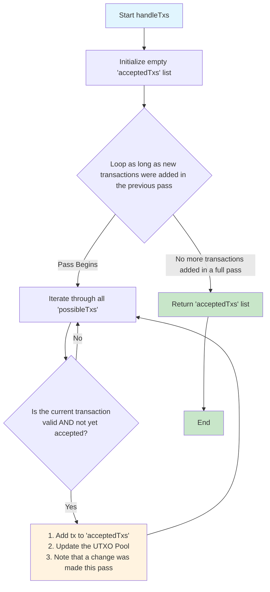

# ScroogeCoin C++ Implementation
-----
<div align="center">

[](https://en.cppreference.com/)
[](https://cmake.org/)
[](https://www.openssl.org/)
[](LICENSE)
[](https://github.com/JEET090806/Scrooge-Coin-with-Cpp/actions)
[](https://github.com/JEET090806/Scrooge-Coin-with-Cpp)

</div>

This repository contains a C++ implementation of **ScroogeCoin**, a simplified, centralized cryptocurrency model based on an assignment from the "Bitcoin and Cryptocurrency Technologies" course. The project builds the core logic for a central authority, Scrooge, to process transactions, validate them against a set of rules, and maintain a public ledger.

-----

## 📜 Table of Contents

* [💡 Core Concepts](#-core-concepts)
* [✨ Features](#-features) 
* [🌊 Process Flow Diagram](#-process-flow-diagram)
* [📂 Project Structure](#-project-structure)
* [⚙️ How to Build and Run](#️-how-to-build-and-run)
* [🧪 Testing](#-testing)
* [🤝 Contributors](#-contributors)

-----

## 💡 Core Concepts

In ScroogeCoin, a central entity named Scrooge receives transactions, organizes them into blocks, validates them, and publishes the ledger.

* **Transactions**: A transaction consists of inputs and outputs.
    * ***Inputs*** claim outputs from previous transactions. Each input must contain a valid digital signature to prove ownership.
    * ***Outputs*** specify a value and the public key of the recipient.
* **UTXO (Unspent Transaction Output)**: Represents a spendable coin. The collection of all current UTXOs is managed in a `UTXOPool`.
* **The Challenge**: Transactions within a single block can reference each other or attempt to spend the same output (a double-spend). This means transactions cannot be validated in isolation, and the main challenge is to select a mutually valid subset of transactions from a given pool.

-----

## ✨ Features

This project implements the `TxHandler` class, which serves as Scrooge's logic engine with modern C++ features:

### `isValidTx(Transaction tx)`

A method that validates a single transaction based on **five critical rules**:

1. All outputs claimed by the transaction's inputs must be in the current UTXO pool.
2. The signatures on each input must be valid.
3. No UTXO can be claimed multiple times within the same transaction.
4. All output values must be non-negative.
5. The sum of the input values must be greater than or equal to the sum of the output values.

### `handleTxs(Transaction[] possibleTxs)`

A method to process a block of potential transactions.

* It returns a **mutually valid transaction set of maximal size** (one that can't be enlarged by simply adding more transactions from the pool).
* It updates its internal UTXO pool to reflect the spent and newly created coins from the accepted transactions.

### C++ Implementation Highlights

* **Object-Oriented Design**: Clean class hierarchy with proper encapsulation
* **STL Integration**: Leverages Standard Template Library for efficient data structures
* **Memory Safety**: Smart pointers and RAII principles
* **OpenSSL Integration**: Cryptographic verification with industry-standard library

-----

## 🌊 Process Flow Diagram

The core logic of this project is in the `handleTxs` method. Because some transactions may depend on the outputs of other transactions within the same block, the handler must loop over the list multiple times. It continues looping and adding valid transactions until a full pass is completed where no new transactions can be accepted.

This diagram illustrates the workflow:



-----

## 📂 Project Structure

```
Scrooge-Coin-with-Cpp/
├── include/                   # Header files (.hpp)
│   ├── Transaction.hpp       # Transaction class definition
│   ├── TxHandler.hpp        # Transaction handler class
│   ├── UTXO.hpp            # UTXO class and utilities
│   └── UTXOPool.hpp        # UTXO pool management
├── src/                     # Source files (.cpp)
│   ├── main.cpp            # Application entry point
│   ├── Transaction.cpp     # Transaction implementation
│   ├── TxHandler.cpp       # Transaction handler implementation
│   └── UTXOPool.cpp        # UTXO pool implementation
├── build/                  # Created by CMake for compiled files
├── CMakeLists.txt         # Build instructions for CMake
└── README.md              # This file
```

-----

## ⚙️ How to Build and Run

### Prerequisites

* A C++ compiler (g++, Clang, etc.) with C++17 support
* CMake (version 3.12 or higher)
* OpenSSL library for cryptographic functions

### Instructions

1. **Clone the repository.**

   ```bash
   git clone https://github.com/JEET090806/Scrooge-Coin-with-Cpp.git
   cd Scrooge-Coin-with-Cpp
   ```

2. **Create a build directory.** Open a terminal in the project's root folder and run:

   ```bash
   mkdir build
   cd build
   ```

3. **Configure the project with CMake.**

   ```bash
   cmake ..
   ```

4. **Compile the code.**

   ```bash
   make
   ```

5. **Run the simulation!**

   ```bash
   ./scrooge_coin
   ```

-----

## 🧪 Testing

Basic validation and testing functionality is included in the main application to verify:

* Transaction creation and validation
* UTXO pool management  
* Digital signature verification
* Double-spending prevention
* Value conservation checks

```bash
# Run the application to see validation examples
./scrooge_coin
```

-----

## 🤝 Contributors

* **Jeet Pandya** - _https://jeetpandya.web.app_ - [GitHub Profile](https://github.com/JEET090806)

-----

## 📄 License

This project is licensed under the MIT License - see the [LICENSE](LICENSE) file for details.

## 🙏 Acknowledgments

* Princeton University's "Bitcoin and Cryptocurrency Technologies" course
* Course instructors for providing the theoretical foundation
* OpenSSL library for cryptographic functions

-----

*This implementation is for educational purposes only and should not be used in production environments.*
